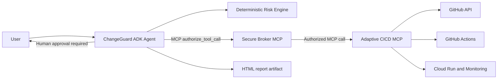

# ChangeGuard AI

ChangeGuard AI is an AI-assisted, human-approved pull-request governance workflow. It analyzes one open GitHub pull request, explains the deployment risk and proposed strategy, pauses for a human decision, and executes approved actions through a secure MCP chain.

The agent never writes to GitHub or calls CI/CD directly. All mutable actions are authorized and audited by the Secure Broker, then performed by the Adaptive CICD MCP server.

## Architecture



## End-to-End Flow

1. The user provides a GitHub pull-request URL: `https://github.com/owner/repository/pull/123`.
2. The agent reads the PR and changed files from GitHub. A missing, closed, merged, inaccessible, or unreadable PR is rejected with a clear error. The active single-PR path never substitutes mock PR data.
3. The deterministic risk engine identifies affected services, consumers, coverage gaps, risk level, recommended tests, decision, and strategy.
4. The agent displays the assessment, an exact preview of the PR comment, and the actions it would take.
5. ADK pauses the workflow and waits for the user to approve, reject, or clarify the plan in natural language.
6. If rejected, ChangeGuard produces an analysis-only report with no PR mutation or pipeline execution.
7. If approved, the agent asks the broker to authorize each action. CICD then posts the assessment comment, merges the PR, and executes the strategy.
8. The agent attaches `changeguard-report.html` to the ADK session with the audit and pipeline outcome.

## Components

| Component | Location | Responsibility | Tools |
|---|---|---|---|
| ChangeGuard Agent | `agent/` | Conversation, PR analysis, approval pause/resume, report generation, orchestration | Broker MCP client only |
| Secure Broker MCP | `broker/` | Policy enforcement, JIT credential issuance, audit logging, forwarding | `authorize_tool_call`, `get_audit_log` |
| Adaptive CICD MCP | `cicd/` | GitHub PR mutation, GitHub Actions dispatch/polling, deployment and monitoring | `comment_pr`, `merge_pr`, `run_tests`, `deploy_canary`, `monitor`, `deploy_full`, `rollback` |

## Strategies

| Risk | Decision | Strategy | Approved execution |
|---|---|---|---|
| `LOW` | `APPROVE` | `DIRECT` | Comment PR -> merge -> tests -> full deployment |
| `MEDIUM` | `APPROVE` | `GATED` | Comment PR -> merge -> tests -> full deployment |
| `HIGH` | `ROLLOUT` | `CANARY` | Comment PR -> merge -> tests -> 10% canary -> monitoring -> full deployment |
| `CRITICAL` | `POSTPONE` | `NONE` | No deployment; analysis-only recommendation |

The strategy-to-workflow mapping lives in [cicd/data/workflow_policy.yaml](cicd/data/workflow_policy.yaml). GitHub workflows must support `workflow_dispatch` and accept the inputs sent by their corresponding CICD tool.

## Project Structure

```text
changeguard-ai/
├── agent/                         # Google ADK conversational workflow
│   ├── agent.py                   # HITL approval, orchestration, report artifact
│   ├── risk_engine/               # Deterministic scoring and test planning
│   ├── tools/                     # GitHub read client, broker client, renderer, simulator
│   ├── templates/app_final.html   # Standalone final report
│   └── README.MD                  # Agent-specific documentation
├── broker/                        # Secure Broker MCP server
│   ├── services/                  # Policy, JIT credentials, audit logging
│   ├── tools/authorize.py         # MCP forwarding to CICD
│   └── data/policies.yaml         # Allowed operations per agent
├── cicd/                          # Adaptive CICD MCP server
│   ├── tools/                     # GitHub Actions, PR comment/merge, deploy, monitor
│   └── data/workflow_policy.yaml  # Strategy-to-workflow mapping
└── README.md                       # Solution documentation
```

## Prerequisites

- Python 3.11 or later
- A Gemini API key or a Google Cloud project with Vertex AI enabled
- GitHub access to the target PR repository
- A GitHub fine-grained token stored only in CICD configuration for live mode
- GitHub Actions workflow files in the target repository

The CICD token needs repository access and at least these fine-grained permissions:

- `Issues: Read and write` to create PR comments
- `Pull requests: Read and write` to merge PRs
- `Actions: Read and write` to dispatch and inspect workflows
- `Contents: Read and write` when required by the repository merge policy

Branch protection rules can still reject a merge. ChangeGuard reports that failure and does not start CI/CD afterward.

## Local Quick Start

Create a virtual environment and install dependencies for each service. Commands below use PowerShell on Windows.

```powershell
cd agent
python -m venv .venv
.\.venv\Scripts\Activate.ps1
pip install -r requirements.txt
Copy-Item .env.example .env
```

```powershell
cd ..\broker
python -m venv .venv
.\.venv\Scripts\Activate.ps1
pip install -r requirements.txt
```

```powershell
cd ..\cicd
python -m venv .venv
.\.venv\Scripts\Activate.ps1
pip install -r requirements.txt
Copy-Item .env.example .env
```

Start the services in separate terminals, in this order:

```powershell
cd cicd
python server.py
```

```powershell
cd broker
python server.py
```

```powershell
cd agent
.\.venv\Scripts\Activate.ps1
python -m google.adk.cli web .
```

Use the ADK web URL printed by the last command. Start a new session, submit an open PR URL, review the assessment, then answer naturally to approve or reject the plan.

Do not run `python agent.py`; it defines the ADK application and must be hosted by the ADK CLI.

## Environment Configuration

### `agent/.env`

```env
MODEL=gemini-3.6-flash
GOOGLE_GENAI_USE_VERTEXAI=false
# GOOGLE_API_KEY=...
# GOOGLE_CLOUD_PROJECT=...
# GOOGLE_CLOUD_LOCATION=us-east1
BROKER_MCP_URL=http://localhost:8080/mcp
LAYER_MODE=live
LOG_LEVEL=INFO
```

`LAYER_MODE=live` enables the post-approval broker/CICD path. `LAYER_MODE=mock` keeps the PR analysis and approval conversation but simulates the post-approval pipeline. The agent does not store a GitHub write token.

### `broker/.env`

```env
PORT=8080
LOG_LEVEL=INFO
CICD_MCP_URL=http://localhost:8082/mcp
# CICD_MCP_TOKEN=...
```

Edit [broker/data/policies.yaml](broker/data/policies.yaml) to control which agent may call which CICD actions. `comment_pr`, `merge_pr`, and deployment actions are policy-controlled and audited.

### `cicd/.env`

```env
PORT=8082
LOG_LEVEL=INFO
CICD_MODE=live
GITHUB_TOKEN=replace-with-a-secret
GITHUB_OWNER=your-owner
GITHUB_REPO=your-repository
GITHUB_REF=main
GITHUB_MERGE_METHOD=squash
GOOGLE_CLOUD_PROJECT=your-project-id
GOOGLE_CLOUD_REGION=us-east1
```

Use `CICD_MODE=simulated` for an offline demo. `CICD_MODE=live` dispatches the workflows configured in [cicd/data/workflow_policy.yaml](cicd/data/workflow_policy.yaml). Keep `GITHUB_TOKEN` in CICD only, preferably in Secret Manager when deployed.

## Validation

Run the component test suites from their service folders:

```powershell
cd cicd
python -m pytest -q tests
```

```powershell
cd broker
python -m pytest -q tests
```

```powershell
cd agent
python -m py_compile agent.py tools\report_renderer.py tools\github_api.py
```

For a full live test, use an open, mergeable PR in a safe repository. Approving the plan causes a real PR comment, merge attempt, and configured GitHub Actions workflow dispatch.

## Cloud Run Notes

Deploy `broker/` and `cicd/` separately. Configure `CICD_MCP_URL` on the broker with the CICD service URL ending in `/mcp`. Configure `BROKER_MCP_URL` on the agent with the broker URL ending in `/mcp`.

Use Cloud Run service authentication and grant the caller `roles/run.invoker` where possible. Store `GITHUB_TOKEN` as a secret, never in source control or documentation.

## License

MIT. Built for the Gemini Enterprise Hackathon 2026.
