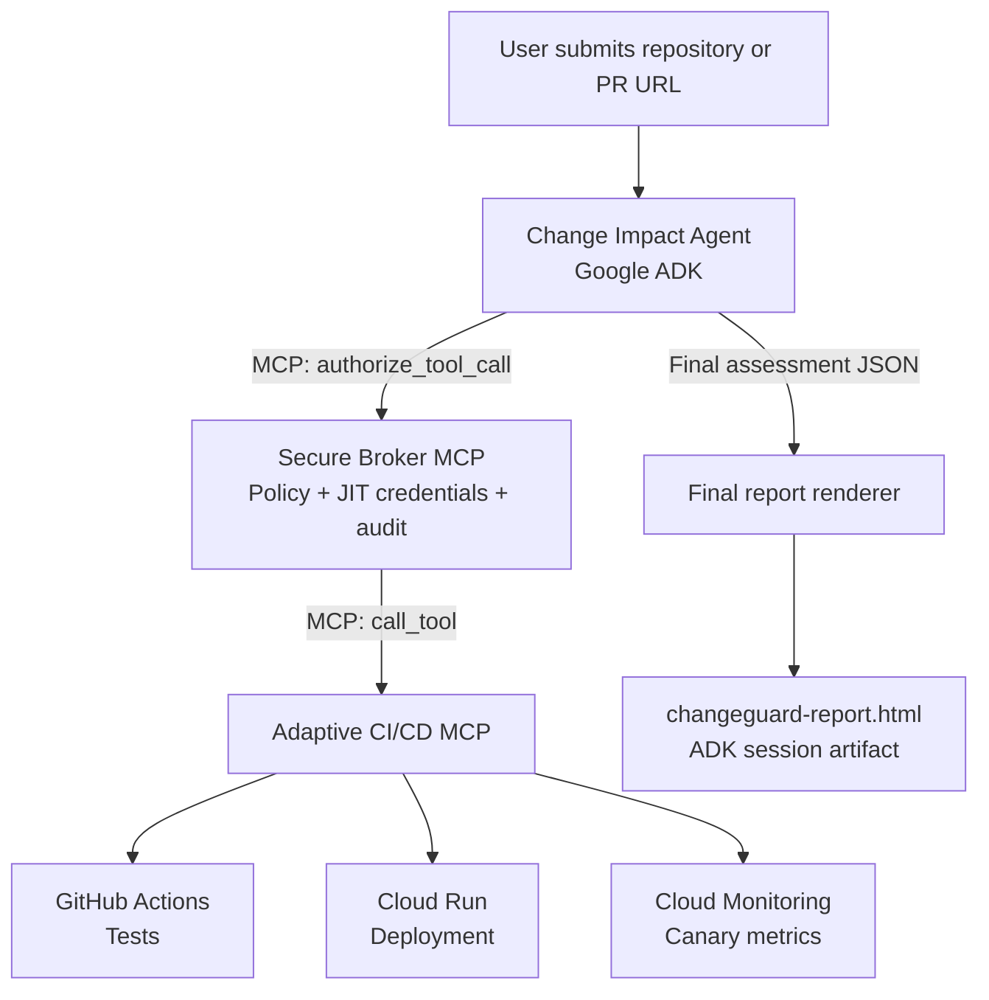

# ChangeGuard AI

AI-powered trust layer for pull-request analysis and controlled CI/CD execution.

ChangeGuard analyzes pull requests, determines their risk, asks the Secure Broker for authorization, and routes approved CI/CD operations through the Adaptive CI/CD MCP server. The final assessment is rendered as a standalone HTML artifact using `agent/templates/app_final.html`.

## Architecture



The agent is the decision-maker. It must not call the CI/CD server directly. The broker is the only execution gateway and is responsible for policy checks, JIT credentials, audit logging, and forwarding authorized requests to CI/CD through MCP.

## Components

| Component | Location | Responsibility | Exposed tools |
|---|---|---|---|
| Change Impact Agent | `agent/` | Fetch PRs, calculate deterministic risk, choose a deployment strategy, synthesize the report | `authorize_tool_call` and `get_audit_log` through the broker MCP toolset |
| Secure Broker MCP | `broker/` | Authorize, audit, issue JIT credentials, and forward execution requests | `authorize_tool_call`, `get_audit_log` |
| Adaptive CI/CD MCP | `cicd/` | Run tests and deployment operations | `run_tests`, `deploy_canary`, `monitor`, `deploy_full`, `rollback`, `pipeline_status` |
| Dashboard template | `agent/templates/app_final.html` | Render report data as a standalone HTML document | None |

## Execution Flow

1. The agent receives a repository URL and fetches its open pull requests from GitHub.
2. The deterministic risk engine identifies affected services, risk level, decision, strategy, test plan, and coverage gaps.
3. For live execution, the agent calls the broker's `authorize_tool_call` tool with `agent_id=change-impact-agent`.
4. The broker validates the policy, creates an audit entry, and calls the corresponding CI/CD MCP tool.
5. CI/CD runs GitHub Actions and, when applicable, Cloud Run deployment and monitoring operations.
6. The synthesis agent produces the final JSON report.
7. The final workflow node embeds that JSON into `app_final.html` and attaches `changeguard-report.html` to the ADK session.

## Deployment Strategies

| Risk level | Decision | Strategy | Expected execution |
|---|---|---|---|
| `LOW` | `APPROVE` | `DIRECT` | Tests, then full deployment |
| `MEDIUM` | `APPROVE` | `GATED` | Tests, then approved full deployment |
| `HIGH` | `ROLLOUT` | `CANARY` | Tests, canary deployment, monitoring, then full deployment |
| `CRITICAL` | `POSTPONE` | `NONE` | No deployment; report the risk and suggested tests |

## Project Structure

```text
changeguard-ai/
├── agent/
│   ├── agent.py                         # ADK workflow and root_agent
│   ├── .env.example                     # Vertex AI and MCP configuration example
│   ├── requirements.txt
│   ├── templates/
│   │   └── app_final.html               # Packaged report template
│   ├── tools/
│   │   ├── analyze_pr.py                # PR fetch and analysis helpers
│   │   ├── context_tools.py             # Context tools and broker delegation
│   │   ├── executions_tools.py          # Broker MCPToolset configuration
│   │   ├── github_api.py                # GitHub repository PR listing
│   │   ├── pipeline_simulator.py        # Local pipeline simulation
│   │   ├── report_renderer.py           # HTML artifact generation
│   │   └── risk_analyzer.py             # Legacy-compatible scoring helper
│   ├── risk_engine/
│   │   ├── rules.py                     # Risk and service rules
│   │   ├── services.py                  # Affected-service detection
│   │   ├── scoring.py                   # Deterministic scoring
│   │   └── test_plan.py                 # Test-plan generation
│   ├── pr_mocks/                        # Demo PR payloads
│   └── tests/                           # Agent and risk-engine tests
├── broker/
│   ├── server.py                        # Secure Broker MCP server
│   ├── tools/authorize.py               # Policy and MCP forwarding
│   ├── tools/audit.py
│   ├── services/                        # Policy, JIT, and audit services
│   ├── data/policies.yaml               # Agent/tool authorization policy
│   └── tests/
├── cicd/
│   ├── server.py                        # Adaptive CI/CD MCP server
│   ├── tools/                           # Tests, deploy, monitor, rollback
│   ├── Dockerfile
│   └── tests/
├── contracts/schemas.json               # Shared contract definitions
└── dashboard/app_final.html             # Standalone dashboard copy
```

## Requirements

- Python 3.11 or newer
- Google Cloud project with Vertex AI enabled
- Application Default Credentials for Vertex AI
- GitHub token with permission to dispatch the configured workflow when using live CI/CD
- MCP 1.x for the broker and CI/CD services (`mcp>=1.3.0,<2.0.0`)

## Local Setup

### Agent

```powershell
cd agent
python -m venv .venv
.\.venv\Scripts\Activate.ps1
pip install -r requirements.txt
Copy-Item .env.example .env
gcloud auth application-default login
```

Set these values in `agent/.env`:

```env
GOOGLE_GENAI_USE_VERTEXAI=true
GOOGLE_CLOUD_PROJECT=your-project-id
GOOGLE_CLOUD_LOCATION=us-east1
GEMINI_MODEL=gemini-2.5-flash
BROKER_MCP_URL=https://your-broker-service.run.app/mcp
LAYER_MODE=live
```

Run the ADK agent from the `agent/` directory:

```powershell
python -m google.adk.cli run .
```

Do not start the ADK agent with `python agent.py`; the file defines the ADK application and workflow, while the ADK CLI provides the runtime.

### Broker

```powershell
cd broker
python -m venv .venv
.\.venv\Scripts\Activate.ps1
pip install -r requirements.txt
python server.py
```

The broker listens on port `8080` by default. Configure its downstream CI/CD MCP endpoint with:

```env
CICD_MCP_URL=https://your-cicd-service.run.app/mcp
```

### CI/CD server

```powershell
cd cicd
python -m venv .venv
.\.venv\Scripts\Activate.ps1
pip install -r requirements.txt
python server.py
```

Use `CICD_MODE=simulated` for local testing. Use `CICD_MODE=live` only after configuring GitHub and Google Cloud credentials.

## Environment Variables

| Variable | Component | Purpose |
|---|---|---|
| `GOOGLE_GENAI_USE_VERTEXAI` | Agent | Select Vertex AI instead of Gemini API key authentication |
| `GOOGLE_CLOUD_PROJECT` | Agent, CICD | Google Cloud project ID |
| `GOOGLE_CLOUD_LOCATION` | Agent | Vertex AI location |
| `GEMINI_MODEL` | Agent | Gemini model name |
| `BROKER_MCP_URL` | Agent | Secure Broker MCP endpoint, normally ending in `/mcp` |
| `CICD_MCP_URL` | Broker | Adaptive CI/CD MCP endpoint, normally ending in `/mcp` |
| `LAYER_MODE` | Agent | `mock` or `live` for context delegation |
| `CICD_MODE` | CICD | `simulated` or `live` |
| `GITHUB_TOKEN` | CICD | Token used to dispatch GitHub Actions |
| `GITHUB_OWNER` | CICD | GitHub repository owner |
| `GITHUB_REPO` | CICD | GitHub repository name |
| `GOOGLE_CLOUD_REGION` | CICD | Cloud Run region, normally `us-east1` |

Use Vertex AI ADC rather than `GOOGLE_API_KEY` when `GOOGLE_GENAI_USE_VERTEXAI=true`.

## Cloud Run Deployment

Deploy each service from its own directory. The image build can be performed by Cloud Build:

```powershell
gcloud builds submit --tag us-east1-docker.pkg.dev/PROJECT_ID/REPOSITORY/changeguard-broker:latest broker
gcloud builds submit --tag us-east1-docker.pkg.dev/PROJECT_ID/REPOSITORY/changeguard-cicd:latest cicd
```

Then deploy the images:

```powershell
gcloud run deploy changeguard-broker `
  --image us-east1-docker.pkg.dev/PROJECT_ID/REPOSITORY/changeguard-broker:latest `
  --region us-east1

gcloud run deploy changeguard-cicd `
  --image us-east1-docker.pkg.dev/PROJECT_ID/REPOSITORY/changeguard-cicd:latest `
  --region us-east1
```

The broker must have `CICD_MCP_URL` configured. The CICD service must have `CICD_MODE=live`, GitHub settings, and the required Cloud Run permissions. Keep Cloud Run authentication enabled when possible and grant the agent or broker service account `roles/run.invoker`; use `--allow-unauthenticated` only when public invocation is an explicit requirement.

## Validation

Run the test suites from the repository root with the agent virtual environment active:

```powershell
python -m pytest agent/tests broker/tests cicd/tests
```

A focused import and report-rendering check is also useful:

```powershell
python -m py_compile agent/agent.py agent/tools/report_renderer.py
```

The local simulated path should be validated in this order:

```text
agent -> broker authorize_tool_call -> CICD MCP run_tests -> response
```

## Demo Scenarios

The repository includes mock PR scenarios under `agent/pr_mocks/` and scenario tests under `agent/tests/test_pr_scenarios/`. These cover low-risk changes, payment and authentication changes, breaking changes, and new endpoints with zero test coverage.

## License

MIT - Built for the Gemini Enterprise Hackathon 2026.
