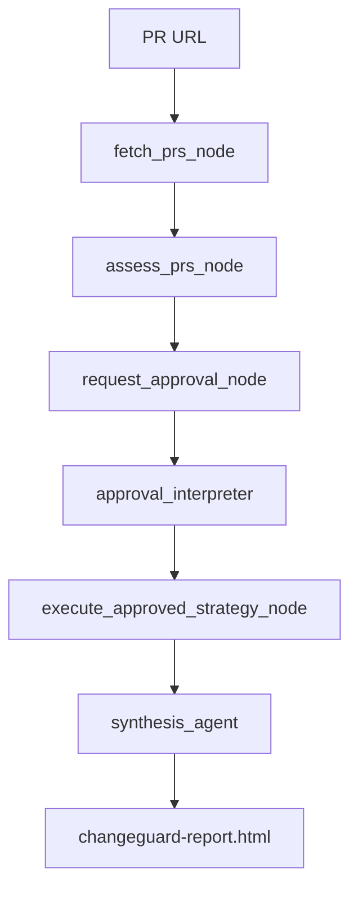

# ChangeGuard AI Agent

The ChangeGuard AI Agent is the conversational orchestration layer of the ChangeGuard solution. It receives one GitHub pull-request URL, analyzes its risk, presents a human-readable plan, waits for explicit user approval, and produces the final HTML report.

It does not write to GitHub and does not call Adaptive CICD directly. Every mutable action is requested through the Secure Broker MCP server.

## Responsibilities

- Validate and read an open GitHub PR and its changed files.
- Reject invalid, inaccessible, closed, or already-merged PRs instead of using mock data.
- Compute deterministic risk, affected services, consumer count, coverage gaps, recommended tests, and deployment strategy.
- Present the assessment, exact PR-comment preview, and proposed post-approval actions.
- Pause through ADK Human-in-the-Loop and interpret natural-language approval, rejection, or ambiguity with Gemini.
- On approval, request broker authorization for PR comment, merge, and the selected CI/CD strategy.
- Produce a standalone `changeguard-report.html` ADK artifact.

## Workflow



### Approval Outcomes

| User intent | Result |
|---|---|
| Approves comment, merge, and execution | The agent calls Broker -> CICD for `comment_pr`, `merge_pr`, and the selected strategy. |
| Rejects execution | The agent returns an analysis-only report. No comment, merge, or CI/CD operation runs. |
| Ambiguous response | The agent remains pending and requests clarification. |

The approval interpreter recognizes natural Spanish or English responses and common typos. It does not depend on a fixed `yes/no` list.

## Security Boundary

```text
Agent -> Secure Broker MCP -> Adaptive CICD MCP -> GitHub / GitHub Actions
```

The agent is allowed to read GitHub PR data. The CICD component owns the GitHub write credential and performs `comment_pr` and `merge_pr`. The Broker evaluates policy, issues JIT credentials, logs the request, and forwards only authorized tools.

## Configuration

Copy `.env.example` to `.env` and configure one model provider.

```env
MODEL=gemini-3.6-flash
GOOGLE_GENAI_USE_VERTEXAI=false
# GOOGLE_API_KEY=...
# GOOGLE_CLOUD_PROJECT=...
# GOOGLE_CLOUD_LOCATION=us-east1

BROKER_MCP_URL=http://localhost:8080/mcp
LAYER_MODE=live
AGENT_PORT=3000
LOG_LEVEL=INFO
```

`LAYER_MODE` controls only the post-approval execution behavior:

| Value | Behavior |
|---|---|
| `live` | Requests real Broker -> CICD operations after approval. |
| `mock` | Keeps the same analysis and approval flow, then uses the local pipeline simulator. |

Do not set `GITHUB_TOKEN` here. It belongs to `cicd/.env` or the CICD Cloud Run secret configuration.

## Run Locally

The Broker and CICD MCP servers must be running before a live post-approval action can work.

```powershell
cd agent
python -m venv .venv
.\.venv\Scripts\Activate.ps1
pip install -r requirements.txt
Copy-Item .env.example .env
python -m google.adk.cli web .
```

Open the local URL printed by ADK. Use a fresh session and provide an open PR URL:

```text
https://github.com/owner/repository/pull/123
```

Do not start the agent with `python agent.py`.

## Main Files

| File | Purpose |
|---|---|
| [agent.py](agent.py) | ADK workflow, Human-in-the-Loop approval, orchestration, and artifact attachment. |
| [tools/github_api.py](tools/github_api.py) | Read-only GitHub PR validation and changed-file retrieval. |
| [tools/executions_tools.py](tools/executions_tools.py) | Secure Broker MCP client. |
| [tools/report_renderer.py](tools/report_renderer.py) | Report normalization and standalone HTML generation. |
| [templates/app_final.html](templates/app_final.html) | Final report template and print/PDF behavior. |
| [risk_engine/](risk_engine/) | Deterministic risk scoring, service mapping, and test-plan generation. |

## PR Validation

The agent stops before analysis when GitHub reports any of these conditions:

- PR URL is malformed.
- PR does not exist.
- PR is closed.
- PR has already been merged.
- GitHub rejects the request because the PR is private or the credential lacks access.
- GitHub cannot be reached.

The active single-PR workflow does not fall back to example PR data. The `pr_mocks/` directory is retained for demos and automated scenario testing only.

## Validation

```powershell
cd agent
.\.venv\Scripts\Activate.ps1
python -m py_compile agent.py tools\github_api.py tools\report_renderer.py
```

See the root [README](../README.md) for the complete multi-service quick start, CICD configuration, policy controls, and deployment notes.
