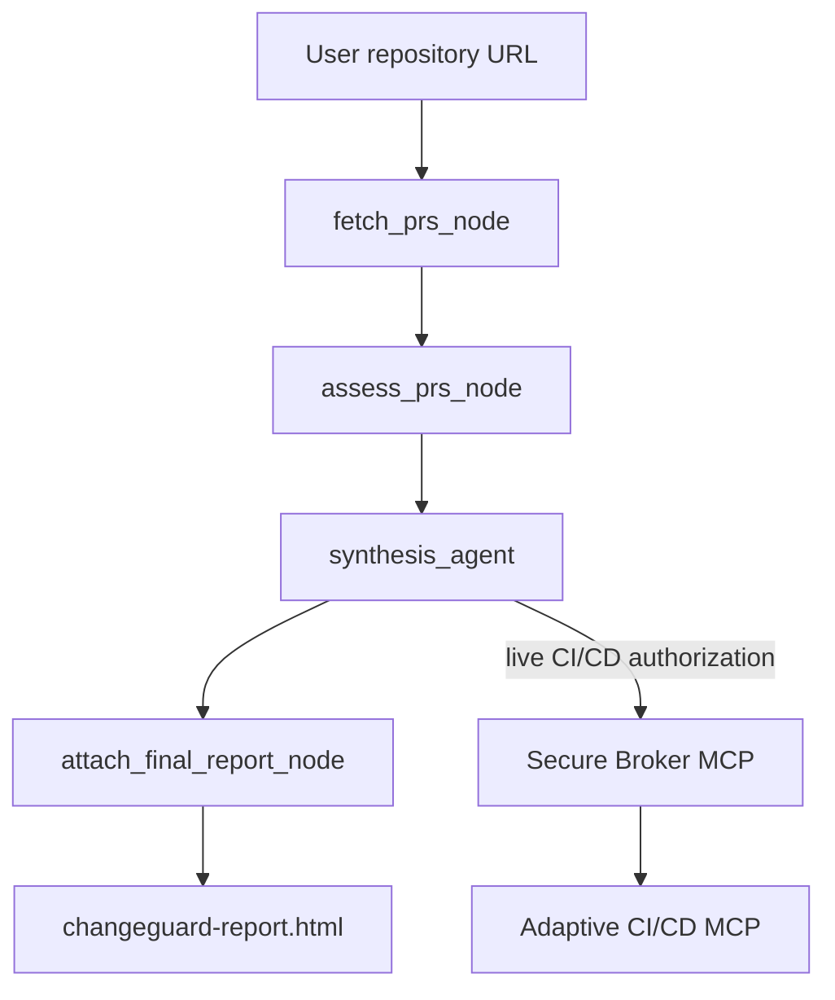

# ChangeGuard AI Agent

The ChangeGuard agent analyzes open GitHub pull requests, calculates deterministic deployment risk, delegates authorized CI/CD operations through the Secure Broker MCP server, and produces a final HTML report attached to the ADK session.

## Responsibilities

The agent is responsible for:

- Receiving a GitHub repository URL.
- Fetching up to 10 recent open pull requests.
- Calculating risk from deterministic Python rules.
- Identifying affected services and consumers.
- Building a test and deployment strategy.
- Requesting authorization before live CI/CD operations.
- Producing the final structured report.
- Attaching `changeguard-report.html` using the packaged dashboard template.

The agent does not call the CI/CD MCP server directly. All live execution goes through the Secure Broker:

```text
Agent -> Secure Broker MCP -> Adaptive CI/CD MCP -> GitHub Actions / Cloud Run
```

## Current Workflow



The exported `root_agent` is the `pr_risk_workflow`. It starts at `fetch_prs_node`, not at `input_agent`. `input_agent` remains available as a separate ADK `App` for URL-validation scenarios, but it is not currently connected as a workflow edge in `root_agent`.

## Workflow Nodes

### `fetch_prs_node`

Extracts a repository URL from the incoming value and calls `fetch_github_prs`.

GitHub endpoint:

```text
GET https://api.github.com/repos/{owner}/{repo}/pulls
    ?state=open&per_page=10&sort=created&direction=desc
```

Each PR contains:

```json
{
  "pr_id": "847",
  "pr_title": "Update refund endpoint",
  "description": "...",
  "pr_url": "https://github.com/owner/repo/pull/847"
}
```

The GitHub helper uses `GITHUB_TOKEN` when available. If the URL is invalid, the API fails, or no open PRs are returned, it falls back to the built-in mock payloads.

### `assess_prs_node`

Runs deterministic scoring for every fetched PR using `tools/risk_analyzer.py`. It produces:

- `risk_score`: `LOW`, `MEDIUM`, `HIGH`, or `CRITICAL`.
- `decision`: `APPROVE`, `ROLLOUT`, or `POSTPONE`.
- `deployment_strategy`: `DIRECT`, `GATED`, `CANARY`, or `NONE`.
- Affected services and consumer count.
- Test plan and suggested tests.
- Escalation reasons and context flags.
- A `pipeline_execution` simulation used as the initial assessment data.

The deterministic mapping is:

| Risk | Decision | Strategy |
|---|---|---|
| `LOW` | `APPROVE` | `DIRECT` |
| `MEDIUM` | `APPROVE` | `GATED` |
| `HIGH` | `ROLLOUT` | `CANARY` |
| `CRITICAL` | `POSTPONE` | `NONE` |

### `synthesis_agent`

Receives `{assessments_data}` through ADK state injection and creates the final JSON array. It must preserve the deterministic risk and pipeline fields, add specific reasoning, and request live execution through the broker when required by the strategy.

The broker tool is the only MCP toolset registered on this agent. Its published tools are:

- `authorize_tool_call`
- `get_audit_log`

For a live operation, the agent sends `agent_id=change-impact-agent`, the exact CI/CD tool name, a session ID, and the tool payload to `authorize_tool_call`. It must not invoke CI/CD directly.

### `attach_final_report_node`

Runs after `synthesis_agent` and:

1. Normalizes the synthesis output to a JSON array.
2. Loads `templates/app_final.html`.
3. Embeds the final report data into the HTML.
4. Removes the external `contracts/agent_output.json` dependency.
5. Saves `changeguard-report.html` with MIME type `text/html` through `ctx.save_artifact`.

The file is therefore attached to the current ADK session and can be downloaded from the conversation UI.

## Output Contract

Each report item contains these top-level fields:

```json
{
  "report_html": "<div>...</div>",
  "report_metadata": {
    "workflow_id": "wf-20260830-847",
    "pr_id": "847",
    "pr_title": "Update refund endpoint",
    "generated_at": "2026-08-30T00:00:00Z",
    "total_duration_seconds": 102,
    "status": "SUCCESS"
  },
  "impact_analysis": {
    "risk_score": "HIGH",
    "decision": "ROLLOUT",
    "strategy": "CANARY",
    "affected_services": ["payment-api"],
    "affected_consumers_count": 12,
    "reasoning": "...",
    "escalation_log": [],
    "coverage_gap_detected": false,
    "context_sources": {}
  },
  "pipeline_execution": {
    "stages": [],
    "final_status": "SUCCESS",
    "total_duration_seconds": 102
  }
}
```

`report_html` is the per-PR card content. The downloadable artifact is the complete dashboard document generated from the same final output.

## MCP Configuration

The agent uses ADK's `MCPToolset` with streamable HTTP and connects only to the broker:

```env
BROKER_MCP_URL=https://your-broker-service.run.app/mcp
LAYER_MODE=live
```

The broker is configured separately with the downstream CI/CD MCP endpoint:

```env
CICD_MCP_URL=https://your-cicd-service.run.app/mcp
```

This separation keeps authorization and audit enforcement in the broker. The agent should not define a direct `CICD_MCP_URL` toolset.

## Environment Variables

| Variable | Required | Purpose |
|---|---|---|
| `GOOGLE_GENAI_USE_VERTEXAI` | Yes for Vertex AI | Select Vertex AI authentication |
| `GOOGLE_CLOUD_PROJECT` | Yes for Vertex AI | Google Cloud project ID |
| `GOOGLE_CLOUD_LOCATION` | Yes for Vertex AI | Vertex AI region |
| `GEMINI_MODEL` or `MODEL` | No | Gemini model; `MODEL` takes precedence |
| `BROKER_MCP_URL` | For live tools | Secure Broker MCP endpoint |
| `BROKER_MCP_TOKEN` | If broker is protected | Bearer token for broker MCP |
| `LAYER_MODE` | No | `mock` or `live` for context delegation |
| `GITHUB_TOKEN` | Optional for PR reads | GitHub API authentication and higher rate limits |

For Vertex AI, authenticate with Application Default Credentials:

```powershell
gcloud auth application-default login
```

Do not set `GOOGLE_API_KEY` when using `GOOGLE_GENAI_USE_VERTEXAI=true`.

## Installation

From the `agent/` directory:

```powershell
python -m venv .venv
.\.venv\Scripts\Activate.ps1
pip install -r requirements.txt
Copy-Item .env.example .env
```

Update `agent/.env` with the project and broker values. The loader reads that file relative to `agent.py`, so startup does not depend on the current working directory.

## Running

Use the ADK CLI from the `agent/` directory:

```powershell
python -m google.adk.cli run .
```

The runtime discovers `root_agent` from `agent.py`. Do not use `python agent.py` as the primary runner; that only imports and defines the application.

## Testing

From the repository root, with the agent environment active:

```powershell
python -m pytest agent/tests
```

Focused checks:

```powershell
python -m py_compile agent/agent.py agent/tools/report_renderer.py
```

Test the HTML renderer independently:

```powershell
python -c "from agent.tools.report_renderer import render_report_html; print(len(render_report_html([])))"
```

For a live end-to-end run, verify this sequence:

```text
1. Agent discovers broker tools.
2. Broker authorizes change-impact-agent.
3. Broker forwards the operation through MCP to CI/CD.
4. CI/CD triggers GitHub Actions or Cloud Run.
5. Agent attaches changeguard-report.html.
```

## Directory Layout

```text
agent/
├── agent.py                         # ADK workflow and root_agent
├── .env.example                     # Configuration template
├── requirements.txt
├── templates/
│   └── app_final.html               # Packaged standalone report template
├── tools/
│   ├── analyze_pr.py                # PR fetch and risk helpers
│   ├── context_tools.py             # Context tools and broker delegation
│   ├── executions_tools.py          # Broker MCPToolset
│   ├── github_api.py                # GitHub repository PR listing
│   ├── pipeline_simulator.py        # Deterministic local pipeline output
│   ├── report_renderer.py           # HTML artifact generation
│   └── risk_analyzer.py             # Keyword-based scoring helper
├── risk_engine/                     # Shared deterministic risk rules
├── pr_mocks/                        # Mock PR payloads
└── tests/                           # Agent and risk-engine tests
```

## Operational Notes

- `agent/.env` is local configuration and must not be committed.
- Live CI/CD requires the broker and CICD services to be reachable and correctly configured.
- The CICD server must use `CICD_MODE=live` to trigger GitHub Actions or Cloud Run operations.
- A simulated `pipeline_execution` value is available during deterministic assessment; live execution results should replace it before the final report claims success.
- The HTML artifact is generated from the final synthesis output, not from a separate JSON file.
